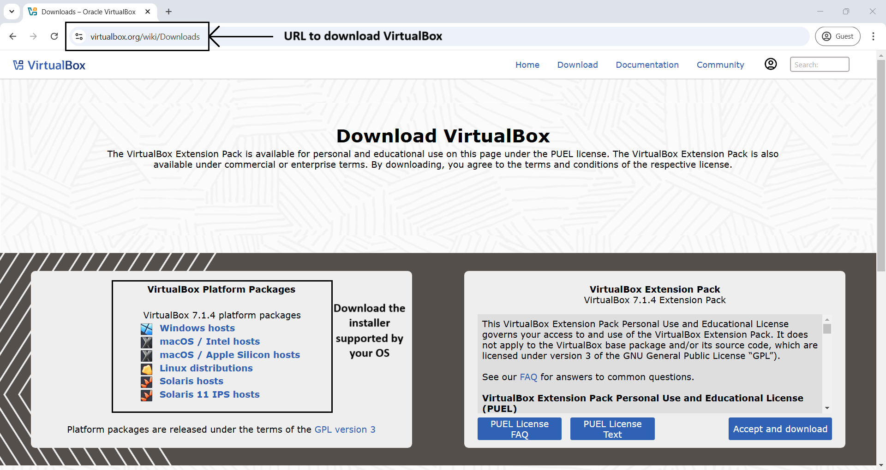
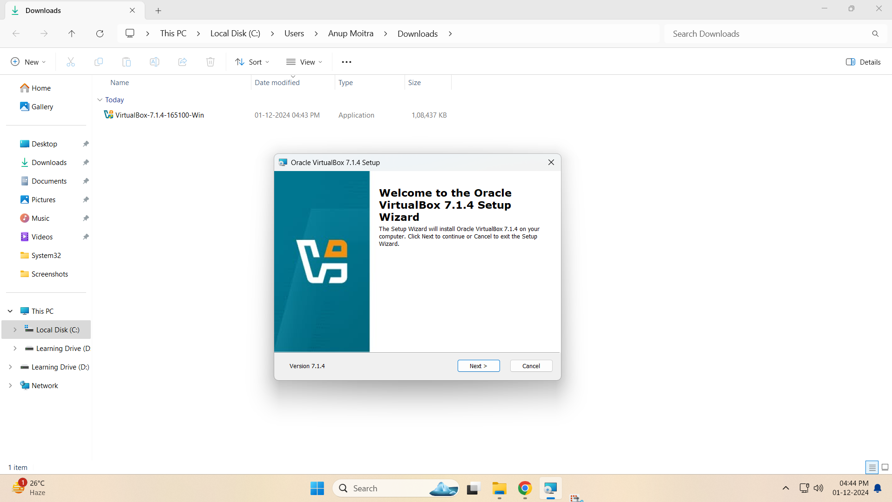
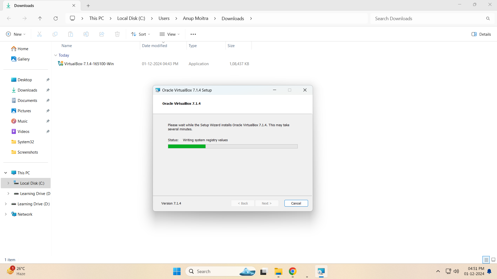
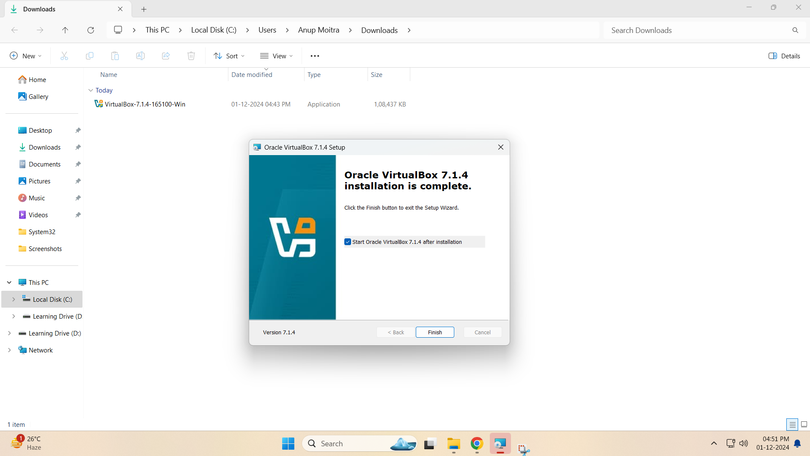
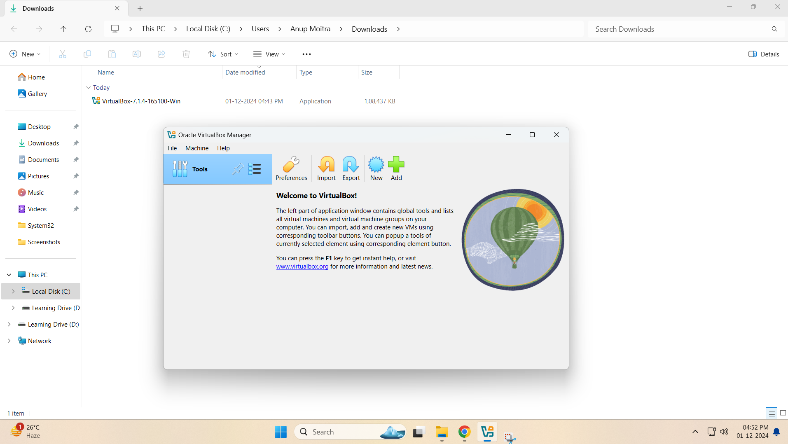

# **Module 1: Virtual Lab Setup**

## **Chapter 1: Download and Install VirtualBox**

 
 

---

### **🖥️ Introduction**
In this chapter, we will guide you through the process of downloading and installing **VirtualBox** on your system. This step will establish the foundational virtual lab required to support your learning of Linux basics and prepare you for future topics.

---

### **🔧 Step-by-Step Instructions**

#### **1️⃣ Download the VirtualBox Installer**
1. Visit the [VirtualBox Downloads page](https://www.virtualbox.org/wiki/Downloads).
2. Select the installer that matches your operating system (Windows, macOS, or Linux).
3. Download the appropriate installer.

#### **2️⃣ Run the Installer**
1. After downloading, launch the installer.
2. Follow the on-screen instructions:
   - Select the installation location (default is fine).
   - Choose additional setup options (network features, shortcuts).
3. Click **Install** to begin the installation process.

#### **3️⃣ Verify Installation**
1. Once installed, open **VirtualBox**.
2. Confirm the installation by checking the version number in the menu (`Help > About VirtualBox`).

---

### **📸 Screenshots**

#### **1️⃣ VirtualBox Download Page**
  
*Figure 1: VirtualBox Download Page*

#### **2️⃣ VirtualBox Installer Start**
  
*Figure 2: VirtualBox Installer Start*

#### **3️⃣ VirtualBox Installation Progress**
  
*Figure 3: VirtualBox Installation Progress*

#### **4️⃣ VirtualBox Installation Finish**
  
*Figure 4: VirtualBox Installation Finish*

#### **5️⃣ VirtualBox First Launch**
  
*Figure 5: VirtualBox First Launch*

---

### **⚙️ Post-Installation Configuration (Optional)**
- Once VirtualBox is installed, check your **network settings** to ensure proper connectivity for your virtual machines.
- You may also want to install the **VirtualBox Extension Pack** for enhanced functionality (such as USB support and improved performance). This can be downloaded from the [VirtualBox website](https://www.virtualbox.org/wiki/Downloads).

> **Note**: Carefully follow the installation prompts to avoid any issues.

---
