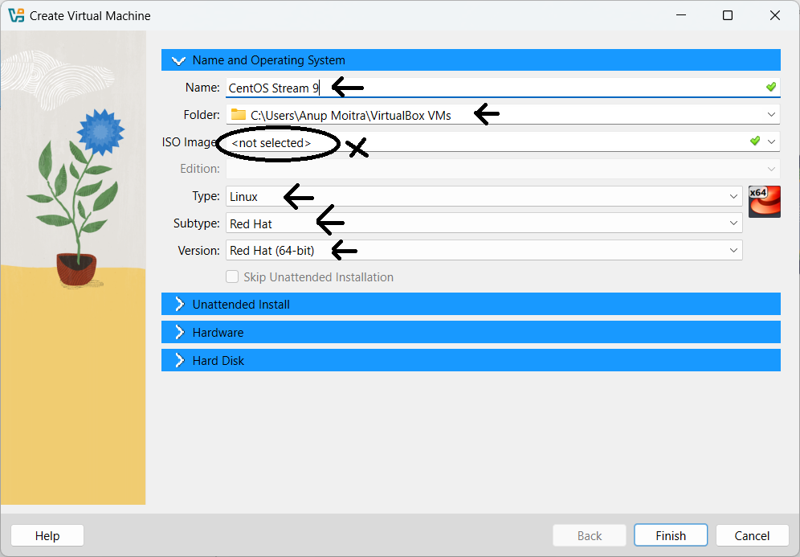
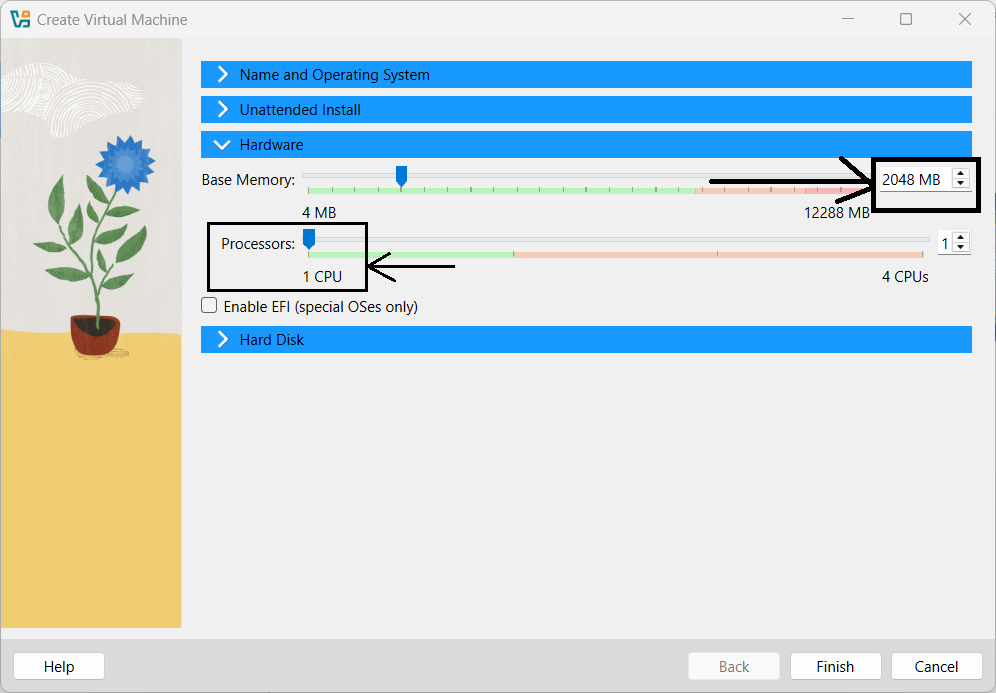
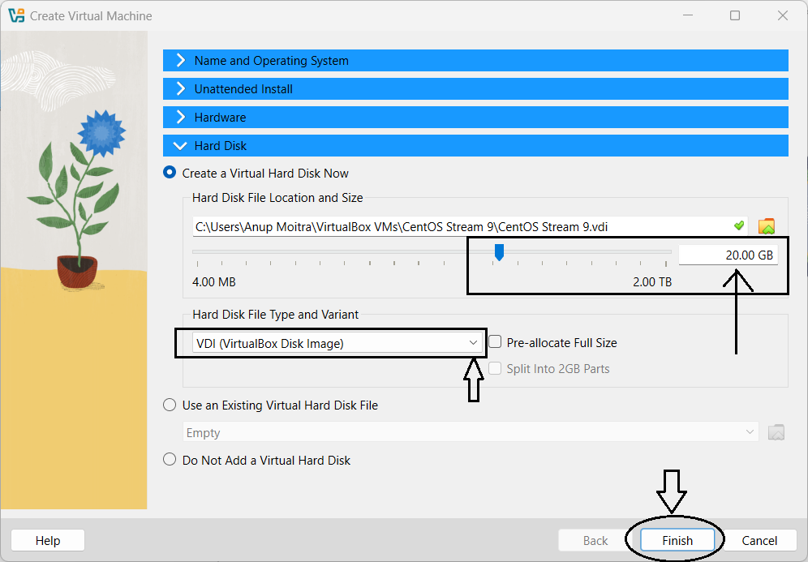
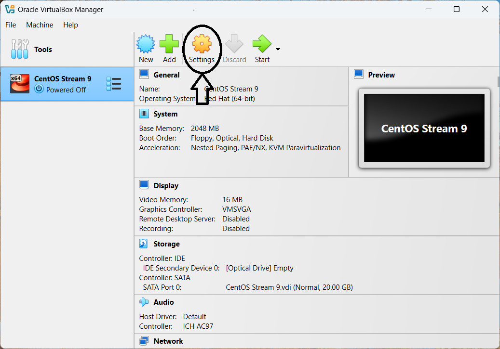
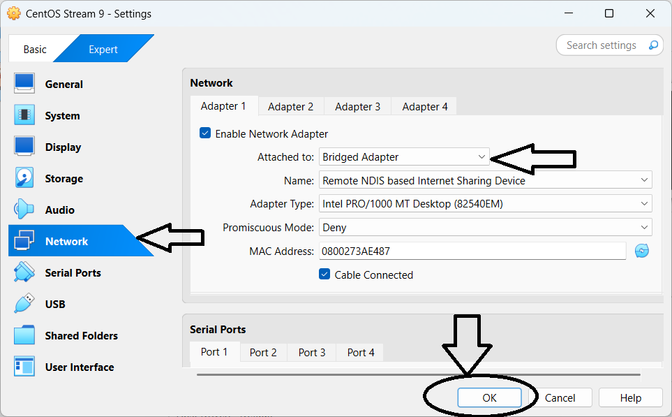

# **Module 1: Virtual Lab Setup**  

## **Chapter 2: Creating and Configuring a Virtual Machine**  

 
 

---

### **📝 Introduction**  
In this chapter, we will guide you through the process of creating and configuring a virtual machine (VM) using **VirtualBox**. This is a crucial step in preparing for the next chapter, where we’ll demonstrate how to download, install, and set up **CentOS Stream 9**, a popular Linux distribution, within this virtual environment.

---

### **👇 Step-by-Step Instructions**  

#### **🚀 1. Launch VirtualBox**  
- Start by opening **VirtualBox** from your system's application menu or desktop shortcut.  

#### **🖥️ 2. Create a New Virtual Machine**  
1. Click the **“New”** button to initiate the virtual machine setup wizard.  
2. Assign a name to the VM, e.g., **"CentOS Stream 9"**. This name is used within **VirtualBox** and is separate from the hostname, which will be configured during OS installation.  
3. Choose the folder for VM files (e.g., `C:\Users\<YourUsername>\VirtualBox VMs`). Ensure the location has enough space.  
4. Leave the **ISO image** field blank for now; we’ll configure it during OS installation in the next chapter.  
5. Select **Linux** as the type and set the version to **Red Hat (64-bit)** to match CentOS Stream 9 (64-bit).  
6. Skip the **Unattended Installation** option to allow manual OS installation with customization.  
7. Configure **Hardware Settings**:  
   - Allocate at least **2 GB (2048 MB)** of RAM (adjust based on system resources).  
   - Keep the default **1 CPU core** or increase it later for better performance.  
8. Configure **Storage Settings**:  
   - Create a **new virtual hard disk** or select an existing one.  
   - Choose **VDI (VirtualBox Disk Image)** as the disk type.  
   - Decide between **dynamically allocated** or **fixed size**.  
   - Set the hard disk size to **at least 20 GB** for the OS and additional software.  

---

### **🌐 Configuring Network Settings**  

1. After the VM is created, select it and click on the **“Settings”** button.  
2. Navigate to the **Network** tab:  
   - Ensure the network adapter is enabled.  
   - By default, it’s set to **NAT**, providing basic network access.  
   - For enhanced connectivity, change it to **Bridged Adapter**, placing the VM on the same network as your host machine.  
3. Click **OK** to save the settings.  

---

### **📸 Screenshots**  

#### **1️⃣ VirtualBox Main Window**  
  
*Figure 1: Locate the "New" button to start creating a new VM.*

#### **2️⃣ VM Creation Wizard - Name, Path, OS Type, and Version**  
  
*Figure 2: Enter the VM name, specify the path, and select the OS type and version.*

#### **3️⃣ VM Creation Wizard - Hardware Configuration**  
  
*Figure 3: Allocate RAM and configure processors for the VM.*

#### **4️⃣ VM Creation Wizard - Hard Disk Configuration**  
  
*Figure 4: Create or select a virtual hard disk.*

#### **5️⃣ Accessing the VM Settings**  
  
*Figure 5: Open the “Settings” menu to adjust configurations.*

#### **6️⃣ Configuring the Network Adapter**  
  
*Figure 6: Change the network adapter to **Bridged Adapter** for enhanced connectivity.*

---

### **🎯 Conclusion**  
Your virtual machine is now created and ready for the next step. In the upcoming chapter, we’ll guide you through downloading the **CentOS Stream 9** ISO image, attaching it to the VM, and detailing the installation process.  

---
