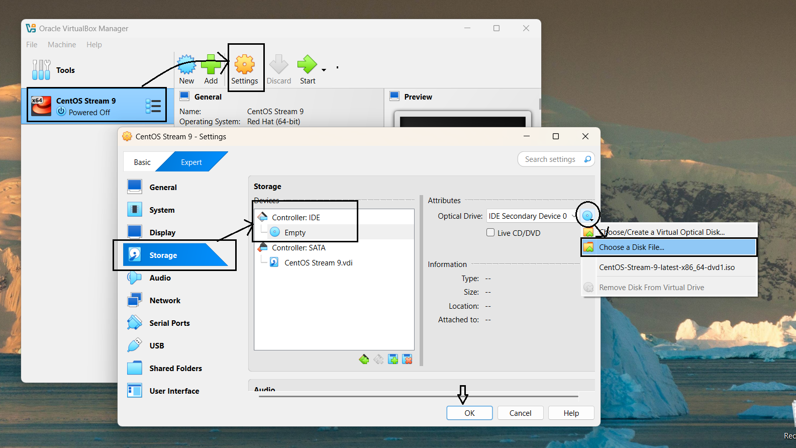
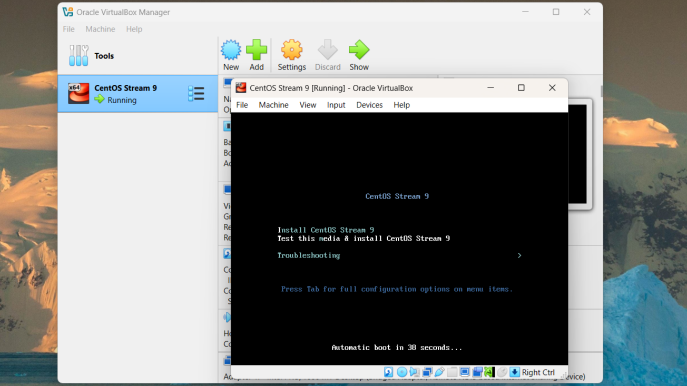
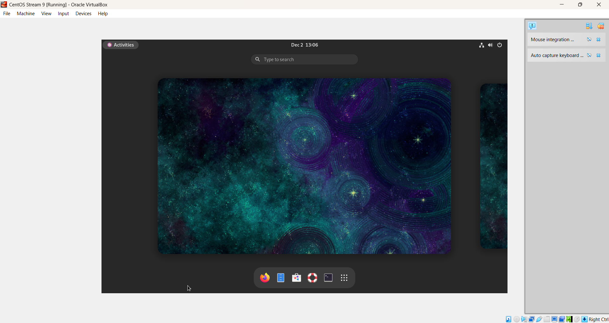

# **Module 1: Virtual Lab Setup**

## **Chapter 3: Download and Install Linux (CentOS Stream 9)**  

 
 
  

---

### **📃 Introduction**  
In this chapter, we will cover how to download and install the CentOS Stream 9 operating system. This chapter provides detailed instructions to set up CentOS Stream 9 in our virtual environment.  

**🖊️ What We Will Learn:**  
- How to download the CentOS Stream 9 ISO image.  
- Step-by-step instructions for installing CentOS Stream 9 on our virtual machine.  

---

### **🚀 Step 1: Visit the CentOS Download Page and Download CentOS Stream 9**

1. Open your web browser and go to the [CentOS download page](https://www.centos.org/download/).
2. Locate the section for **CentOS Stream 9** and select the correct architecture for your system, such as **x86_64**.
3. Click on the download link to start downloading the CentOS Stream 9 ISO file.

---

### **🌐 Step 2: Attach the CentOS ISO to the Virtual Machine**

1. Open **VirtualBox** and select the virtual machine you created in the previous chapter (e.g., "CentOS Stream 9").
2. Click on **"Settings"** and navigate to the **"Storage"** tab.
3. In the **Controller: IDE** section, click on the **"Empty"** optical drive icon.
4. Click on the **"Choose a disk file"** option and locate the CentOS Stream 9 ISO file you downloaded.
5. Select the ISO file and click **OK** to attach it to the virtual machine.

---

### **💡 Step 3: Boot the Virtual Machine from the ISO**

1. Start the virtual machine by clicking the **"Start"** button in VirtualBox.
2. The CentOS Stream 9 installation menu should appear. Select **"Install CentOS Stream 9"** and press **Enter** to begin the installation.

---

### **⚖️ Step 4: Configure Installation Settings**

On the **Installation Summary** screen, review and adjust the following settings:

**🔧 Localization:**  
- **Language and Keyboard Layout**: Select the appropriate language and keyboard layout for the installation (e.g., English (India), English (India, with rupee)), and click **"Continue"**.
- **Date & Time**: Set the correct time zone for your region (e.g., Asia/Kolkata).
- **Language Support**: Ensure your preferred language is selected.

**🌄 Software:**  
- **Installation Source**: This is typically set to **Local Media** if the ISO file is attached. No changes are needed here.
- **Software Selection**:  
  - Choose **Server with GUI** if you need a graphical interface.  
  - Select **Minimal Install** for a lightweight server setup.

**🛠️ System:**  
- **Installation Destination**: Select the virtual hard disk created in the previous chapter. If needed, modify the partitioning options or leave the default **Automatic Partitioning**. Click **Done** to save.
- **KDUMP**: Leave this enabled unless you have specific requirements to disable it.
- **Network & Hostname**:  
  - Ensure the network adapter is enabled for internet access.  
  - Optionally, assign a hostname for the system (e.g., `centos-vm.local`).

**🔑 User Settings:**  
- **Root Password**: Set a strong root password to secure the system.
- **User Creation**: Create a new user account with administrator privileges. This is recommended for better security than using the root account for daily tasks.

Click **"Begin Installation"** to start the installation process.

---

### **⏳ Step 5: Complete the Installation**

1. Once the installation is complete, click **"Reboot"** to restart the virtual machine.
2. Ensure the ISO is detached from the virtual machine to boot from the installed operating system.

---

## **🖼 Screenshots**

### **1️⃣ CentOS Download Page**  
  
*Download the CentOS Stream 9 ISO image.*

### **2️⃣ Attach ISO to Virtual Machine**  
  
*Attach the CentOS ISO file to the virtual machine.*

### **3️⃣ Installation Menu**  
  
*Installation menu for CentOS Stream 9.*

### **4️⃣ Installation Summary Screen**  
  
*Options available on the installation summary screen.*

### **5️⃣ CentOS Home Screen**  
  
*Initial view of the CentOS home screen after installation.*

---

## **💡 Note**  
The CentOS Stream 9 installation is now complete. The virtual machine is ready for further configuration and use.  

In the next chapter, we’ll explore post-installation setup and basic commands to get started with CentOS Stream 9!  

---
