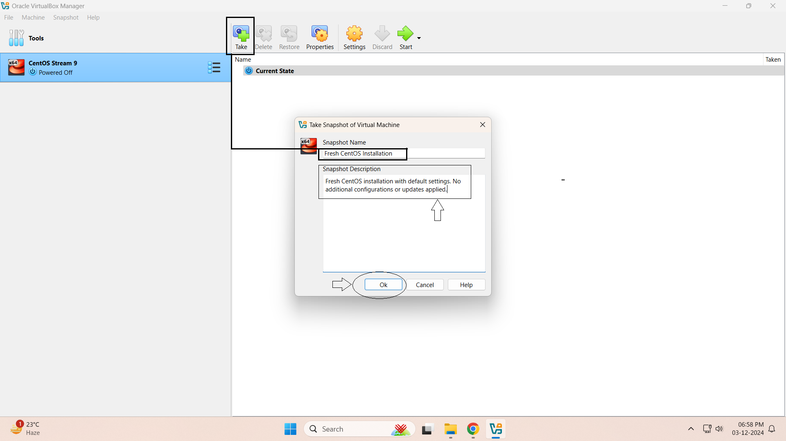
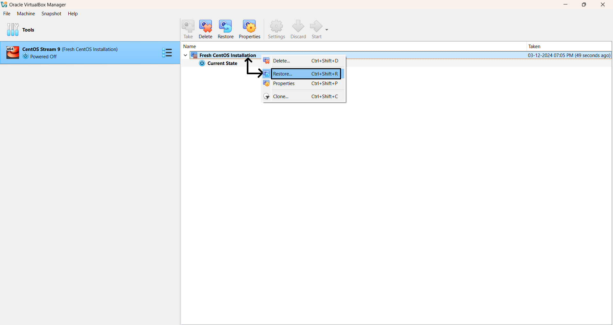

# **Module 1: Virtual Lab Setup**  

## **Chapter 4: Taking Snapshots in VirtualBox**  
 
 
  

---

### **🖥️ Introduction**  
In this chapter, we will explore the concept of **snapshots** in VirtualBox. Snapshots allow you to save the state of a virtual machine at a specific point in time, which is useful for testing, experimentation, and rollback scenarios.

---

### **🔧 Step-by-Step Instructions**  

#### **1️⃣ Access the Snapshot Manager**  
- Open **VirtualBox** and select the virtual machine for which you want to take a snapshot.  
- Click on the **"Snapshots"** tab in the right-hand pane.  

#### **2️⃣ Take a Snapshot**  
- Click the **"Take Snapshot"** button (camera icon) or right-click on the current state and select **"Take Snapshot"**. 📸  
- Provide a **name** and an **optional description** for the snapshot (e.g., *"Pre-Update Configuration"*).  
- Click **OK** to save the snapshot.  

#### **3️⃣ Restore a Snapshot**  
- Go to the **Snapshots** tab.  
- Right-click on the snapshot you want to restore and select **"Restore"**. 🔄  
- Confirm the restoration process when prompted.  

#### **4️⃣ Delete a Snapshot**  
- Navigate to the **Snapshots** tab.  
- Right-click on the snapshot you want to delete and select **"Delete Snapshot"**. ❌  
- Confirm the deletion.  

---

### **📸 Screenshots**  

#### **1️⃣ Snapshot Manager**  
  
*Figure 1: Snapshot Manager in VirtualBox.*  

#### **2️⃣ Take Snapshot**  
  
*Figure 2: Taking a new snapshot with a name and description.*  

#### **3️⃣ Restore Snapshot**  
  
*Figure 3: Restoring the virtual machine to a previous snapshot.*  

#### **4️⃣ Delete Snapshot**  
  
*Figure 4: Deleting an unwanted snapshot.*  

---

### **⚙️ Additional Tips**  
- Snapshots are not a replacement for full backups. They are ideal for short-term recovery points but should not be relied upon for long-term data protection.  
- Be aware that storing too many snapshots can consume significant disk space and impact system performance.  
- Regularly back up your virtual machines to ensure you have a secure copy of your data.  

---

### **📌 Note**  
Snapshots are a powerful tool for virtual machine management. However, it’s important to manage them carefully to avoid cluttering your storage and negatively impacting system performance. 💡  

---
