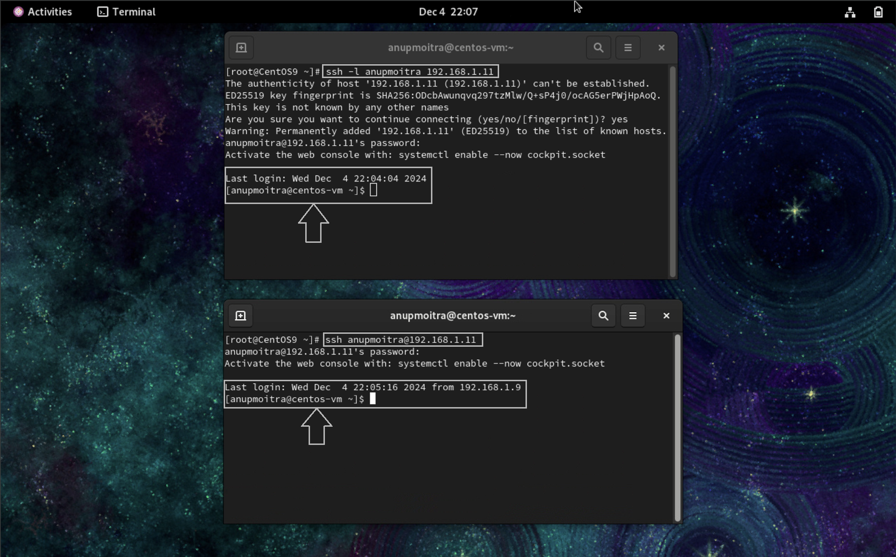

# **Module 2: System Access and File Management**  
## **Chapter 3: Accessing Linux Machine via PuTTY or SSH**  
  

---

### **🖥️ Introduction**  
This chapter explores how to access a Linux machine remotely using various platforms: **Windows SSH client**, **Mac Terminal**, **Linux Terminal**, and **PuTTY on Windows**. SSH (Secure Shell) is a widely-used protocol that ensures secure access and management of remote systems.

---

### **📚 What We Will Learn**  
- Methods to access a Linux machine from Windows (using SSH client or PuTTY), macOS, and Linux.  
- How to find the IP address of your Linux machine.  

---

### **1️⃣ Finding the IP Address of the Linux Machine**  

Before connecting, locate the Linux machine’s IP address:

1. **Access the Linux Console**: Open your virtual or physical Linux machine.  
2. **Run the Command**:  
   - For modern distributions:  
     ```bash
     ip addr
     ```  
   - For older distributions:  
     ```bash
     ifconfig
     ```  
3. **Identify the IP Address**:  
   - Look for the `enp0S3` or similar interface and note the IP address (e.g., `192.168.42.212`).  
   - If `ifconfig` is unavailable, install it using:  
     ```bash
     sudo yum install net-tools
     ```

**Example Output**:  
`ip addr` and `ifconfig` showing the IP address:  


---

### **2️⃣ Accessing Linux Machine via PuTTY (Windows)**  

For Windows users who prefer a graphical client, **PuTTY** is a popular choice:  

1. **Download and Install PuTTY**:  
   - Refer to [Chapter 2](https://github.com/anup-cloudguru/foundational-linux-training-projects/blob/main/02-system-access-and-file-management/02-accessing-linux-system.md) for installation steps.  

2. **Launch PuTTY**:  
   - Open PuTTY from the Start menu.  

3. **Configure the SSH Connection**:  
   - In the **Session** tab:  
     - Enter the **IP address** of your Linux machine in the "Host Name" field.  
     - Use the default **Port 22**.  
     - Set **Connection Type** to `SSH`.  

4. **Start the Session**:  
   - Click **Open**.  
   - Accept the server’s key if prompted (first-time connections).  

5. **Log In**:  
   - Enter your Linux **username** and press Enter.  
   - Type your **password** (hidden as you type) and press Enter.  

**Example Output**:  
PuTTY session with successful login:  


---

### **3️⃣ Accessing Linux Machine via Windows SSH Client**  

1. **Open Command Prompt**: Type `cmd` in the Windows search bar and press Enter.  
2. **Verify SSH Installation**:  
   - Run `ssh` in the Command Prompt. If you see usage options, SSH is installed.  
3. **Connect to the Linux Machine**:  
   - **Option 1**:  
     ```bash
     ssh -l <username> <IP_address>
     ```  
   - **Option 2**:  
     ```bash
     ssh <username>@<IP_address>
     ```  
   - **Example**:  
     - Using `-l`:  
       ```bash
       ssh -l anupmoitra 192.168.42.212
       ```  
     - Using `@`:  
       ```bash
       ssh anupmoitra@192.168.42.212
       ```  
   - Enter your password to complete the connection.  

**Example Output**:  
Windows Command Prompt displaying successful login:  


---

### **4️⃣ Accessing Linux Machine via Mac Terminal**  

1. **Open Terminal**: Use **Cmd + Space** to search for `Terminal`, then press Enter.  
2. **Connect to the Linux Machine**:  
   - **Option 1**:  
     ```bash
     ssh -l <username> <IP_address>
     ```  
   - **Option 2**:  
     ```bash
     ssh <username>@<IP_address>
     ```  
   - **Example**:  
     - Using `-l`:  
       ```bash
       ssh -l anupmoitra 192.168.42.212
       ```  
     - Using `@`:  
       ```bash
       ssh anupmoitra@192.168.42.212
       ```  
   - Enter your password to access the Linux machine.  

**Example Output**:  
Mac Terminal connected to Linux:  


---

### **5️⃣ Accessing Linux Machine via Linux Terminal**  

1. **Open Terminal**: Use **Ctrl + Alt + T** or search for Terminal.  
2. **Connect to the Linux Machine**:  
   - **Option 1**:  
     ```bash
     ssh -l <username> <IP_address>
     ```  
   - **Option 2**:  
     ```bash
     ssh <username>@<IP_address>
     ```  
   - **Example**:  
     - Using `-l`:  
       ```bash
       ssh -l anupmoitra 192.168.42.212
       ```  
     - Using `@`:  
       ```bash
       ssh anupmoitra@192.168.42.212
       ```  
   - Provide your password to complete the connection.  

**Example Output**:  
Linux Terminal displaying successful login:  


---

### **✅ Conclusion**  

You can access a Linux machine from various platforms using command-line tools like `ssh` or graphical tools like **PuTTY**. While modern Windows systems include an SSH client, **PuTTY** remains a versatile choice, especially for GUI-based configurations.  

To enhance security, always use strong passwords or SSH keys when accessing remote systems.  

---
