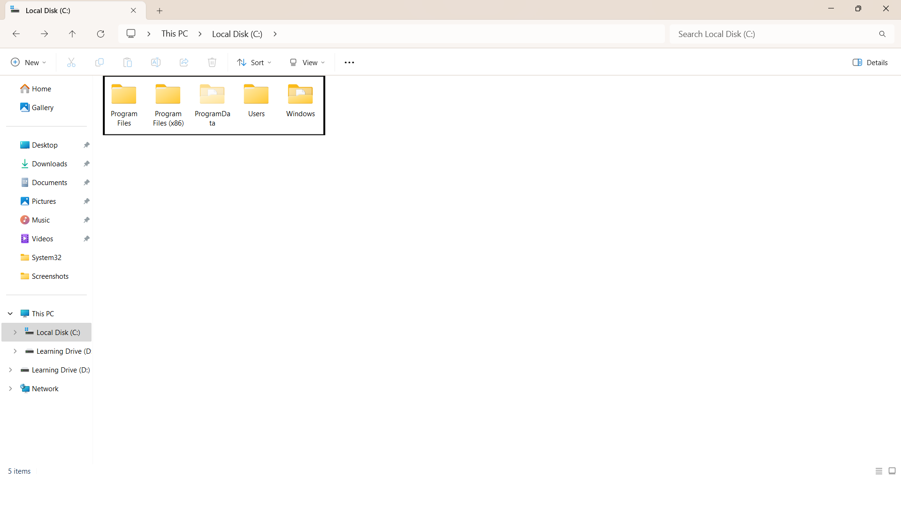
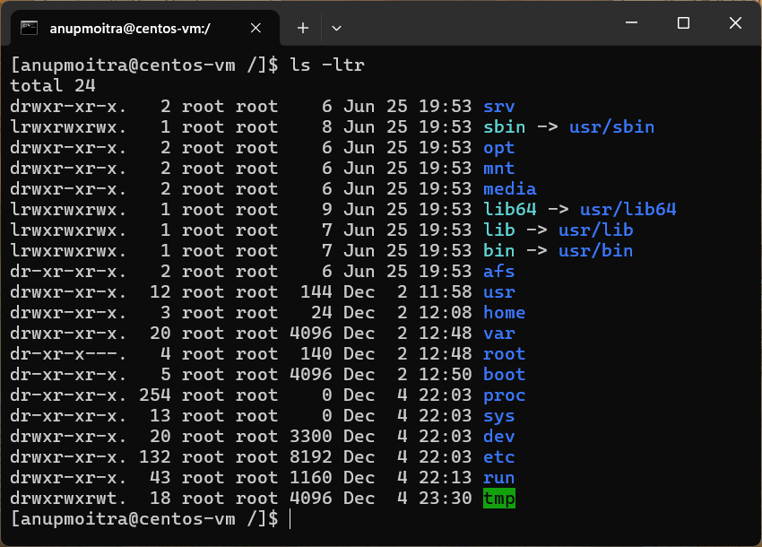

# **Module 2: System Access and File Management**  
## **Chapter 5: Filesystem Basics**  
    

---

### **🖥️ Introduction**  
In this chapter, we will explore the concept of a filesystem and its role in managing files and directories. A filesystem is essential for organizing and retrieving data efficiently. Understanding the structure of a filesystem is crucial for both Windows and Linux environments.  

---

### **📚 What We Will Learn**  
- The purpose and structure of filesystems.  
- Key directories in Windows and Linux.  
- Navigating filesystems using GUI and command-line tools.  
- Comparing Windows and Linux filesystem structures.  

---

### **1️⃣ What is a Filesystem?**  

A filesystem is a method an operating system uses to organize and manage data on storage devices. It creates a structured environment for storing and retrieving files and directories.  

**Analogy**: Think of a filesystem as a library where books (files) are categorized into sections (directories). Without organization, finding a specific book would be chaotic.  

---

### **2️⃣ Filesystem Structure Overview**  

#### **Windows Filesystem**  
Windows organizes its filesystem with drive letters (e.g., `C:\`) representing storage volumes. Each drive has a hierarchical directory structure.  

**Key Directories in `C:\`:**  

| **Directory**             | **Description**                                      |
|---------------------------|------------------------------------------------------|
| `C:\Windows`              | System files and configurations for Windows operation. |
| `C:\Users`                | User profiles and personal data storage.             |
| `C:\Program Files`        | Installed applications for 64-bit programs.          |
| `C:\Program Files (x86)`  | Installed applications for 32-bit programs on 64-bit systems. |
| `C:\ProgramData`          | Shared application data for all users.               |

**Example Screenshot**:  
  
*Figure 1: Example of Windows Filesystem Structure.*  

---

#### **Linux Filesystem**  
Linux uses a unified structure starting from a single root directory (`/`), branching into subdirectories.  

**Key Directories in Linux:**  

| **Directory**    | **Description**                                         |
|-------------------|---------------------------------------------------------|
| `/boot`          | Bootloader files needed for system startup.              |
| `/root`          | Home directory for the root (administrator) user.        |
| `/etc`           | System and application configuration files.              |
| `/home`          | Personal files for regular users.                        |
| `/var`           | Variable data like logs and caches.                      |
| `/dev`           | Device files for hardware components.                    |
| `/tmp`           | Temporary files deleted on reboot.                       |
| `/proc`          | Virtual directory for real-time process information.     |
| `/usr/bin`       | User binaries for everyday commands like `ls` and `cp`.  |
| `/sbin`          | System binaries for administrative tasks.                |

**Example Screenshot**:  
  
*Figure 2: Example of Linux Filesystem Structure.*  

---

### **3️⃣ Navigating the Filesystem**  

#### **Windows Navigation**  

- **Graphical Interface**:  
  Use File Explorer to browse directories and manage files.  

- **Command-Line Interface**:  
  Use Command Prompt or PowerShell to navigate directories.  

**Example Command**:  
```cmd
cd C:\Users\YourUsername\Documents
```  

---

#### **Linux Navigation**  

- **Graphical Interface**:  
  Use file managers like Nautilus (Ubuntu) or Dolphin (KDE).  

- **Command-Line Interface**:  
  Use commands like `cd` (change directory) and `ls` (list contents).  

**Example Command**:  
```bash
cd /home/username/Documents
ls -l
```  

---

### **4️⃣ Comparing Filesystem Structures**  

| **Aspect**            | **Windows**                        | **Linux**                              |
|-----------------------|------------------------------------|---------------------------------------|
| **Root Directory**    | Separate volumes (e.g., `C:\`)    | Single root directory (`/`)          |
| **Directory Paths**   | Use backslashes (e.g., `C:\`)     | Use forward slashes (e.g., `/home`)  |
| **User Directories**  | `C:\Users`                       | `/home/username` for users, `/root` for root user. |
| **Configuration Files** | Scattered across `C:\`         | Centralized in `/etc`.               |  

---

### **5️⃣ Importance of Filesystems**  

A well-structured filesystem ensures:  
- Faster access to files and directories.  
- Efficient system management and performance.  
- Proper organization of user data and system configurations.  

---

### **✅ Conclusion**  

Understanding filesystem structures and navigation is a fundamental skill for any computer user. Whether managing personal files or configuring systems, familiarity with Windows and Linux filesystems is invaluable for efficient and effective data management.  

---
