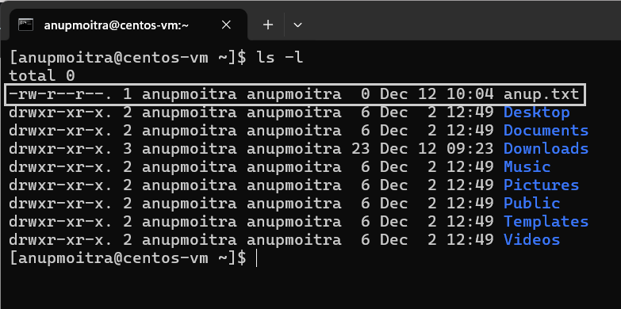
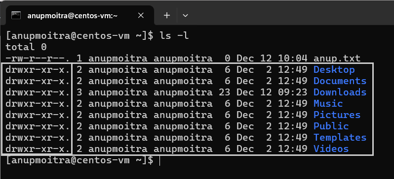
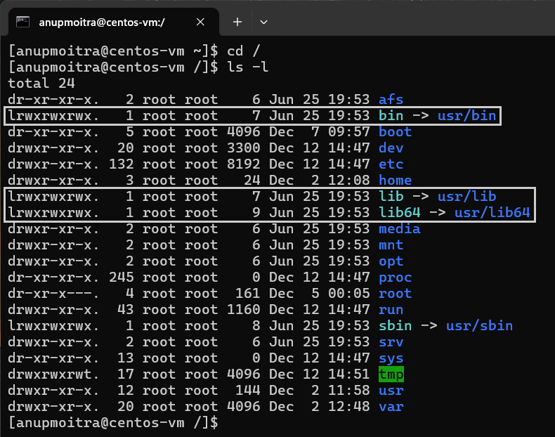
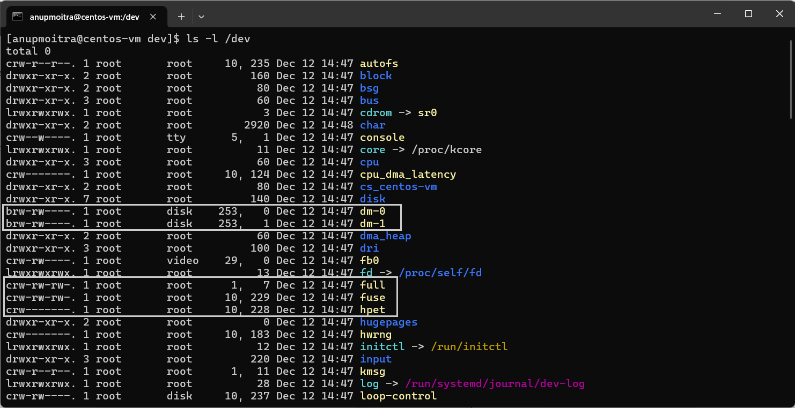
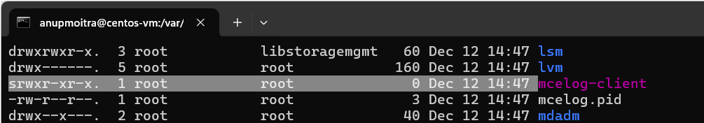

# **Module 2: System Access and File Management**  
## **Chapter 8: Understanding Linux File Types**  
   

---

### **📖 Introduction**  
In Linux, files are not just data containers but are categorized into various types that serve specific purposes. These include:  
- **📄 Regular Files**: Text, executables, or binary data.  
- **📁 Directories**: Containers for organizing files.  
- **🔗 Links**: References to other files or directories.  
- **💻 Device Files**: Interfaces to hardware devices.  
- **🔌 Sockets and Pipes**: For process communication.  

This chapter explores these file types, their characteristics, and how to identify them using the **`ls -l`** command.

---

### **🔍 1. File Types Overview**  

#### **1.1 📄 Regular Files**  
Regular files are the most common type in Linux, containing various forms of data such as:  
- Text documents  
- Media files (images, videos, etc.)  
- Program executables  

**How to Identify**:  
- In `ls -l` output, regular files are represented by a `-` in the first character (e.g., `-rw-r--r--`).  

**Example Command**:  
```bash
ls -l
```  

**Example Output**:  
```
-rw-r--r--  1 user group 1234 Dec 25 12:00 example.txt
```

**Screenshot**:  
  
*Figure 1: Example of regular files displayed with `ls -l`.*  

---

#### **1.2 📁 Directories**  
Directories act as containers for files and subdirectories, similar to folders in other operating systems.  

**How to Identify**:  
- Represented by a `d` in the first character of the `ls -l` output (e.g., `drwxr-xr-x`).  

**Example Command**:  
```bash
ls -l
```  

**Example Output**:  
```
drwxr-xr-x  2 user group 4096 Dec 24 15:30 my_directory
```

**Screenshot**:  
  
*Figure 2: Example of directories displayed with `ls -l`.*  

---

#### **1.3 🔗 Links**  
Links are special files referencing other files or directories.  
- **Symbolic Links (Soft Links)**: Reference the original file.  
- **Hard Links**: Direct references to the file’s data.  

**How to Identify**:  
- Represented by an `l` in the first character of the `ls -l` output (e.g., `lrwxrwxrwx`).  

**Example Command**:  
```bash
ls -l
```  

**Example Output**:  
```
lrwxrwxrwx  1 user group   9 Dec 25 12:00 my_link -> target_file
```

**Screenshot**:  
  
*Figure 3: Example of links displayed with `ls -l`.*  

---

#### **1.4 💻 Device Files**  
Device files represent hardware components and are located in the `/dev` directory. They fall into two categories:  

1. **Character Device Files**  
   - Represent devices that handle data one character at a time (e.g., keyboards).  
   - Identified by a `c` in `ls -l` output.  

2. **Block Device Files**  
   - Represent devices that handle data in blocks (e.g., hard drives).  
   - Identified by a `b` in `ls -l` output.  

**Example Command**:  
```bash
ls -l /dev
```  

**Example Output**:  
```
crw-rw----  1 root group   1, 3 Dec 25 12:00 tty
brw-rw----  1 root group   8, 0 Dec 25 12:00 sda
```

**Screenshot**:  
  
*Figure 4: Example of character (`c`) and block (`b`) device files in `/dev`.*  

---

#### **1.5 🔌 Sockets**  
Sockets enable inter-process communication, particularly for network-based operations.  

**How to Identify**:  
- Represented by an `s` in the first character of the `ls -l` output (e.g., `srwxr-xr-x`).  

**Example Command**:  
```bash
ls -l
```  

**Example Output**:  
```
srwxr-xr-x  1 user group    0 Dec 25 12:00 my_socket
```

**Screenshot**:  
  
*Figure 5: Example of a socket file displayed with `ls -l`.*  

---

#### **1.6 🟡 Named Pipes (FIFOs)**  
Named pipes, also known as FIFOs, enable first-in, first-out communication between processes.  

**How to Identify**:  
- Represented by a `p` in the first character of the `ls -l` output (e.g., `prw-r--r--`).  

**Example Command**:  
```bash
ls -l
```  

**Example Output**:  
```
prw-r--r--  1 user group    0 Dec 25 12:00 my_pipe
```

---

### **🌟 2. Why File Types Matter**  
Understanding file types is crucial for:  
- **Identifying File Roles**: Determines the purpose of files within the system.  
- **Troubleshooting Issues**: Helps pinpoint hardware or process-related problems.  
- **Efficient Administration**: Assists in managing links, devices, and communication files effectively.  

---

### **📜 Conclusion**  
Linux file types serve distinct roles in system operation and management. Using commands like **`ls -l`**, you can easily identify and understand file attributes, enhancing your ability to troubleshoot, organize, and manage Linux systems effectively.  

Mastering file types will deepen your understanding of Linux's architecture and improve your system administration skills.  

---
