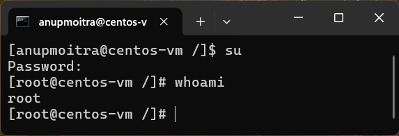

# **Module 2: System Access and File Management**  
## **Chapter 9: Understanding Root in Linux**  
   

---

### **📖 Introduction**  
In Linux, the term **"root"** has multiple meanings depending on the context. It can refer to:  
- **Root Account**: The superuser account with full system privileges.  
- **Root Directory (`/`)**: The topmost directory in the filesystem hierarchy.  
- **Root Home Directory (`/root`)**: The private home directory of the root user.  

This chapter will clarify these distinctions and demonstrate their respective roles in Linux.  

---

### **🔍 Root in Linux**  

#### **1. 🧑‍💼 Root Account**  
The **root account** is the superuser in Linux, holding unrestricted access to all commands, files, and system settings. It is analogous to the **Administrator** account in Windows.  

- **Key Features**:  
  - Full control over the entire system.  
  - Can execute any command, including those that modify critical system files.  
  - Represented by the username `root` (lowercase).  

- **Switching to Root Account**:  
  Use either of the following commands:  
  ```bash
  sudo -i
  ```  
  or  
  ```bash
  su
  ```  

**Screenshot**:  
  
*Figure 1: Example of switching to the root account using `sudo -i` or `su`.*  

---

#### **2. 📂 Root Directory (`/`)**  
The **root directory** is the top-level directory in Linux, from which all other files and directories originate. It is represented by the symbol `/`.  

- **Key Features**:  
  - Serves as the starting point for the entire filesystem hierarchy.  
  - Contains essential directories such as `/bin`, `/etc`, `/home`, and `/var`.  
  - Critical for system organization and operation.  

- **Viewing the Root Directory**:  
  To list the contents of the root directory, use:  
  ```bash
  ls /
  ```  

**Screenshot**:  
  
*Figure 2: Listing the contents of the root directory (`/`).*  

---

#### **3. 🏠 Root Home Directory (`/root`)**  
The **root home directory** (`/root`) is the private directory where the root user stores personal files and settings.  

- **Key Features**:  
  - Similar to `/home/<username>` for regular users but specific to the root account.  
  - Accessible **only** to the root user.  
  - Regular users cannot view or modify `/root` without elevated privileges.  

- **Navigating to the Root Home Directory**:  
  Once logged in as root, access it using:  
  ```bash
  cd /root
  ```  

**Screenshot**:  
  
*Figure 3: Navigating to the root home directory (`/root`).*  

---

### **📘 Clarifying Terminology**  
To avoid confusion, here's a summary of the three contexts of "root":  

| **Term**                | **Description**                                                  | **Example Usage**             |  
|--------------------------|------------------------------------------------------------------|--------------------------------|  
| **Root Account**         | The superuser account with unrestricted system privileges.      | `sudo -i` or `su`             |  
| **Root Directory (`/`)** | The topmost directory in the Linux filesystem hierarchy.        | `ls /`                        |  
| **Root Home Directory (`/root`)** | The private home directory for the root user.            | `cd /root`                    |  

---

### **⚠️ Best Practices**  

- **Minimal Use of Root Privileges**:  
  Always use the root account sparingly to minimize risks of accidental system modifications.  

- **Use `sudo` Over `su` When Possible**:  
  `sudo` provides more granular control over administrative privileges, reducing security risks.  

- **Secure the Root Account**:  
  Ensure strong passwords and limit root access to trusted administrators.  

---

### **📜 Conclusion**  
Understanding the distinctions between the root account, the root directory, and the root home directory is crucial for effective system administration. By using root privileges responsibly and understanding its role in the Linux ecosystem, you can ensure a secure and well-maintained system.  

---
