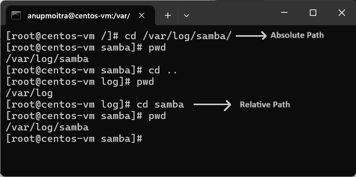

# **Module 2: System Access and File Management**  
## **Chapter 11: Absolute and Relative Paths**  

  

---

### **📖 Introduction**  
In Linux, navigating the file system efficiently is key to managing files and directories. This chapter explores the differences between **absolute** and **relative paths** and demonstrates how to use them with the `cd` command.  

**What We Will Learn**:  
- The distinction between absolute and relative paths.  
- How to use `cd` to navigate directories using both path types.  
- Commands for verifying the current directory and moving up the directory tree.  

---

### **🛠️ Understanding Absolute and Relative Paths**  

#### **1️⃣ Absolute Path**  
- An **absolute path** always begins with a forward slash `/`, indicating that the path starts from the **root directory**.  
- **Example**: To navigate directly to the Samba folder in `/var/log/`, use:  
   ```bash
   cd /var/log/samba
   ```  
- This path is fully qualified and independent of your current location in the file system.  

#### **2️⃣ Relative Path**  
- A **relative path** does not start with a slash. It refers to a location relative to your current directory.  
- **Example**: If you are currently in `/var`, you can navigate to the `logs` directory by using:  
   ```bash
   cd logs
   ```  
- Since `logs` is a subdirectory of `/var`, you don’t need to specify the full path.  

#### **3️⃣ Key Differences**  
| **Feature**        | **Absolute Path**               | **Relative Path**           |  
|---------------------|---------------------------------|-----------------------------|  
| **Starts with `/`** | Yes                             | No                          |  
| **Depends on CWD**  | No                              | Yes                         |  
| **Example**         | `/var/log/samba`               | `logs` (when in `/var`)     |  

---

### **📸 Screenshot Example**  
Below is an example of navigating using both absolute and relative paths:  

  
*Figure 1: Navigating directories using absolute and relative paths.*  

---

### **⌨️ Tab Completion**  

#### **What is Tab Completion?**  
- **Definition**: Tab completion allows you to automatically complete file and directory names by pressing the `Tab` key.  
- **Benefits**: It reduces the need for typing long file names and prevents typos.  

#### **How to Use It**  
1. Start typing a path or filename.  
2. Press the `Tab` key, and the terminal will automatically complete it if the path exists.  

**Example**:  
```bash
cd /var/lo
```  
Press `Tab`, and it completes to:  
```bash
cd /var/log/
```  

---

### **🔚 Conclusion**  
Mastering absolute and relative paths is essential for effective navigation and management of the Linux file system. By understanding how to use `cd` with both types of paths, you can move around directories quickly and efficiently. Additionally, **tab completion** helps reduce typing errors and streamline your workflow.  

---
