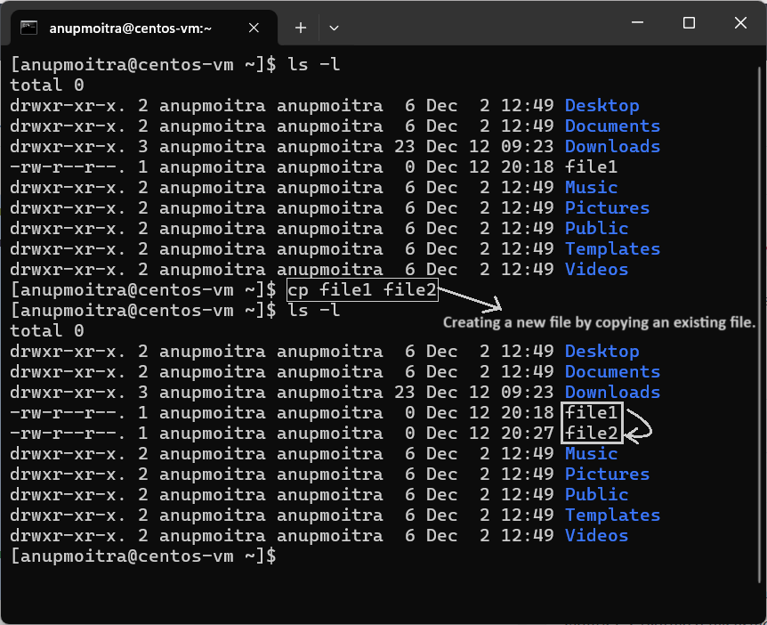

# **Module 2: System Access and File Management**  
## **Chapter 12: Creating Files and Directories in Linux**  

        

---

### **📖 Introduction**  
In this chapter, we’ll explore various ways to create files and directories in Linux. Mastering these methods is essential for effective file management and organization in a Linux environment.  

---

## **📝 Commands for Creating Files**  

### 1. **Using the `touch` Command**  
The `touch` command is used to create an empty file.  

**Example**:  
```bash
touch file1
```  
To verify the file creation, use the `ls -l` command.  

**Screenshot Example**:  
  
*Figure 1: Creating a file using the `touch` command and verifying with `ls -l`.*  

---

### 2. **Using the `cp` Command**  
You can create a new file by copying an existing file.  

**Example**:  
```bash
cp file1 file2
```  
This command copies the contents of `file1` into a new file named `file2`.  

**Screenshot Example**:  
  
*Figure 2: Copying a file using the `cp` command.*  

---

### 3. **Using the `vi` or `vim` Editor**  
You can create and edit a file using the `vi` or `vim` editor.  

**Example**:  
```bash
vi file3
```  

To save and exit:  
1. Make your edits in the file.  
2. Press `Esc` to enter command mode.  
3. Use one of the following commands:  
   - **`:wq`**: Save the file and quit.  
   - **`:wq!`**: Save the file and quit, overriding warnings (e.g., for read-only files).  

**Screenshot Example**:  
  
*Figure 3: Saving and exiting the `vi` editor using `:wq`.*  

---

### 4. **Creating Multiple Files with a Single Command**  
You can create multiple files in one go using the `touch` command.  

**Example**:  
```bash
touch file4 file5 file6
```  

**Screenshot Example**:  
  
*Figure 4: Creating multiple files in one command using `touch`.*  

---

## **📁 Commands for Creating Directories**  

### 1. **Using the `mkdir` Command**  
The `mkdir` command is used to create a new directory.  

**Example**:  
```bash
mkdir directory1
```  

**Screenshot Example**:  
  
*Figure 5: Creating a directory using `mkdir`.*  

---

### 2. **Creating Multiple Directories**  
You can create multiple directories at once with a single `mkdir` command.  

**Example**:  
```bash
mkdir dir2 dir3 dir4
```  

**Screenshot Example**:  
  
*Figure 6: Creating multiple directories using `mkdir`.*  

---

## **🔒 Permissions and Root Privileges**  

Files and directories can typically be created in locations where the current user has appropriate permissions. For example, standard users have full access to their **home directory** (e.g., `/home/username`) and can freely create, modify, or delete files within it.  

However, certain system directories, such as `/etc`, `/root`, and `/var`, are restricted. Attempting to create files or directories in these areas without sufficient privileges will result in a **"Permission denied"** error.  

**Example of a failed attempt**:  
```bash
touch /etc/restricted_file
```  
In this case, the command tries to create a file named `restricted_file` in the `/etc` directory. Since this directory is restricted to privileged users, the operation will fail unless the user is logged in as `root` or executes the command with elevated privileges (e.g., using `sudo`).  

To check your current user, use the following command:  
```bash
whoami
```  
This command outputs the username of the account currently logged into the terminal session. If the output is `root`, you have administrative privileges. Otherwise, you are operating as a standard user and will need to use `sudo` or switch to the root user for tasks requiring higher permissions.  

### **Key Points to Remember**:  
1. **Root User**: The `root` user has unrestricted access to the entire system. Use it cautiously.  
2. **Elevated Privileges**: Use `sudo` to temporarily execute commands with administrative rights.  

**Example with Elevated Privileges**:  
```bash
sudo touch /etc/restricted_file
```  

---

## **📚 Summary**  

In this chapter, we covered:  
- Creating files using `touch`, `cp`, and `vi/vim`.  
- Creating directories with `mkdir`.  
- Handling permissions and understanding root privileges.  

Master these commands to efficiently manage files and directories in Linux!  

--- 
