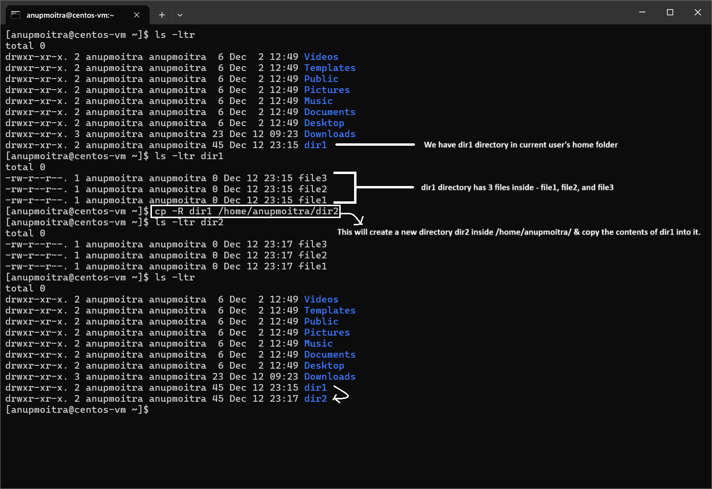

# **Module 2: System Access and File Management**  
## **Chapter 13: Copying Directories**  

   

---

### **📖 Introduction**  
In this chapter, we’ll explore how to copy directories in Linux. While we’ve previously covered file management techniques, copying directories is an essential skill, particularly when managing configuration files or backups. The `cp -R` command ensures that all contents, including subdirectories and files, are copied over correctly, preserving the directory structure.  

---

## **🔧 The `cp` Command for Copying Directories**  

### 1. **Using the `cp` Command with the `-R` Option**  
The `cp` command is used to copy files, but when dealing with directories, the `-R` (recursive) option is required. This ensures all subdirectories and files are copied, preserving the entire directory structure.  

**Syntax**:  
```bash
cp -R source_directory destination_directory
```  

- **`-R`**: Copies the directory and its entire contents (files and subdirectories).  
- **`source_directory`**: The directory you want to copy.  
- **`destination_directory`**: The target location where the directory will be copied.  

**Example**:  
To copy the `dir1` directory to `/home/anupmoitra/dir2`:  
```bash
cp -R dir1 /home/anupmoitra/dir2
```  

If `dir2` does not exist, it will be created.  

**Screenshot Example**:  
  
*Figure 1: Copying the `dir1` directory to `/home/anupmoitra/dir2` using the `cp -R` command.*  

---

### 2. **What Happens Without the `-R` Option?**  
If you attempt to copy a directory without the `-R` option, an error will occur.  

**Example**:  
```bash
cp dir1 dir2
```  

**Output**:  
```
cp: omitting directory 'dir1'
```  

The error occurs because `cp` treats the directory as a file unless `-R` is specified.  

**Screenshot Example**:  
  
*Figure 2: Error message when trying to copy a directory without using the `-R` option.*  

---

### **📝 Verifying the Copied Directory**  
After copying, verify the directory and its contents with the `ls` command:  

**Example**:  
```bash
cd /home/anupmoitra/dir2
ls -l
```  

This lists all files and subdirectories within `/home/anupmoitra/dir2`, confirming the successful copy of `dir1` and its contents.  

---

### **⚠️ Important Notes**  

- **Recursive Copy**: Always include the `-R` option when copying directories to ensure all contents are copied. Without it, subdirectories are omitted.  
- **Permissions**: Ensure you have the necessary permissions to copy directories to restricted locations. Use `sudo` if required.  

**Example with Elevated Privileges**:  
```bash
sudo cp -R dir1 /etc/backup
```  

This copies `dir1` to `/etc/backup` using administrative privileges.  

---

### **🔚 Summary**  
In this chapter, we covered:  
- How to copy directories using the `cp -R` command.  
- The significance of the `-R` option for recursive copying.  
- Methods to verify the successful copying of directories.  

Mastering the `cp` command with `-R` is essential for managing directories, creating backups, and efficiently handling files in Linux systems.  

---
