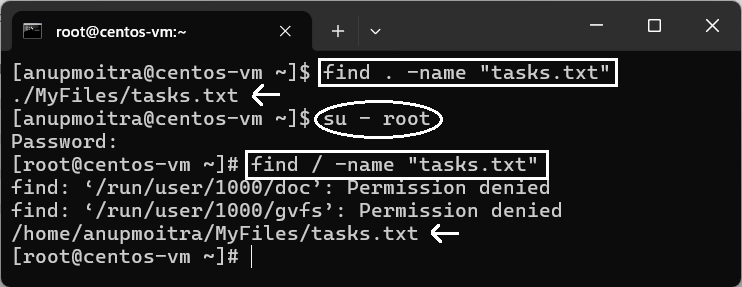
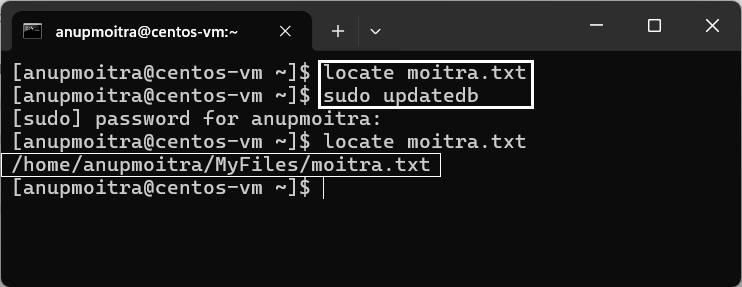

# **Module 2: System Access and File Management**  
## **Chapter 14: Finding Files and Directories (find, locate)**  

    

---

### **🛠️ Preparation Before Starting**  
To get started with this chapter, create a practice environment by following these steps:  

1. **Create Sample Files**:  
   ```bash
   touch report.txt notes.txt tasks.txt
   ```  
   This creates three text files: `report.txt`, `notes.txt`, and `tasks.txt` in your current directory.  

2. **Organize Files into a Directory**:  
   ```bash
   mkdir MyFiles
   mv report.txt notes.txt tasks.txt MyFiles
   ```  
   This moves the created files into a new directory named `MyFiles`.  

---

### **📖 Introduction**  
Linux provides powerful tools for locating files and directories. In this chapter, we explore two commonly used commands:  

- **`find`**: Performs detailed, real-time searches based on various criteria.  
- **`locate`**: Uses a prebuilt database for faster filename searches.  

These commands simplify file navigation and system management tasks.  

---

## **🔍 The `find` Command**  

The `find` command searches for files and directories in a specified path using criteria like name, type, or date.  

### **1. Basic Syntax of the `find` Command**  
```bash
find [path] [expression]
```  
- **`path`**: Directory to start the search (e.g., `.` for current directory, `/` for the root directory).  
- **`expression`**: Search criteria, such as `-name`.  

#### Example 1: Search in the Current Directory  
```bash
find . -name "tasks.txt"
```  
Searches for a file named `tasks.txt` in the current directory and its subdirectories.  

#### Example 2: Search from the Root Directory  
```bash
find / -name "tasks.txt"
```  
Searches for `tasks.txt` from the root directory. This may return permission-denied errors unless run with `sudo`.  

#### Example 3: Search for a Directory  
```bash
find . -type d -name "MyFiles"
```  
Searches for directories (`-type d`) named `MyFiles` in the current directory and subdirectories.  

**Screenshot Examples**:  
- *Figure 1: Searching for a file using the `find` command.*  
    
- *Figure 2: Searching for a directory using `find`.*  
    

---

## **⚡ The `locate` Command**  

The `locate` command is faster than `find` because it searches a prebuilt file database.  

### **1. Basic Syntax of the `locate` Command**  
```bash
locate [filename]
```  
#### Example: Search for a File  
```bash
locate notes.txt
```  
Quickly finds all files and directories containing `notes.txt`.  

### **2. Updating the Locate Database**  
Since `locate` uses a database, updating it ensures accurate results:  
```bash
sudo updatedb
```  
Run this command to refresh the database and include recent changes.  

**Screenshot Example**:  
- *Figure 3: Using `locate` and updating the database with `updatedb`.*  
    

---

## **💡 Key Differences Between `find` and `locate`**  

| **Feature**           | **`find`**                        | **`locate`**                   |  
|------------------------|------------------------------------|---------------------------------|  
| **Speed**             | Slower (real-time search)         | Faster (uses database)         |  
| **Customization**     | Highly flexible search criteria   | Limited to filename searches   |  
| **Up-to-date Results**| Real-time                        | Requires database update       |  
| **Database Required** | No                               | Yes                            |  
| **Command for Updates**| Not needed                      | `sudo updatedb`                |  

---

## **✅ Summary**  
In this chapter, we covered:  
- **`find`**: Real-time, flexible file and directory search.  
- **`locate`**: Fast filename search using a prebuilt database.  
- Key differences between the two commands and when to use each.  

These tools enhance your ability to locate and manage files in Linux, saving time and effort in navigating complex systems.  

---
