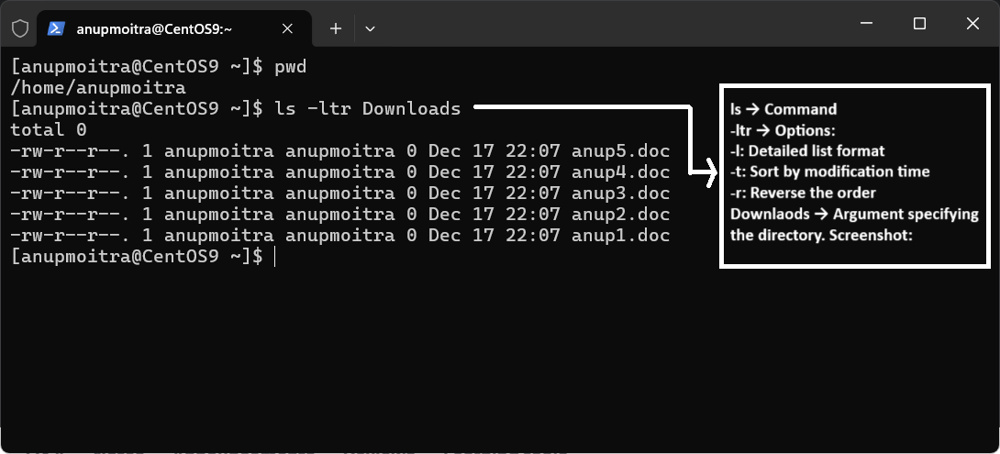

# **Module 3: Linux Fundamentals**

## **Chapter 1: Linux Command Syntax**

 

---

### **🔑 Introduction**
Understanding the syntax of Linux commands is fundamental for effectively navigating and working in a Linux environment. Every command follows a structured syntax that includes **commands**, **options**, and **arguments**. In this chapter, we’ll break down the components of a Linux command and explain how to use options and arguments to enhance their functionality.

---

### **📚 Components of Linux Command Syntax**

The general syntax of a Linux command is as follows:

```bash
command [option(s)] [argument(s)]
```

- **`command`**: The core instruction to perform a specific task.
- **`option(s)`**: Modifies the behavior of the command. Options typically start with a hyphen (`-` for single-letter, `--` for full words).
- **`argument(s)`**: Specifies additional information, such as file names or directories.

---

### **1️⃣ Commands**
Commands are the core instructions you give to the Linux system to perform specific tasks.

**Example**:  
The `ls` command lists files and directories in the current working directory.

```bash
ls
```


---

### **2️⃣ Options**
Options modify how a command behaves. They usually come with a hyphen (`-`) and may also be combined.

**Example**:  
The `-l` option with `ls` displays detailed information about files and directories:

```bash
ls -l
```

You can combine options like `-l` and `-t` to sort files by modification time:

```bash
ls -lt
```

Grouping multiple options can also be done under a single hyphen:

```bash
ls -ltr
```

**Explanation**:
- `-l`: Long format (detailed information).
- `-t`: Sort by modification time.
- `-r`: Reverse the order.


---

### **3️⃣ Arguments**
Arguments provide additional input to a command. They specify files, directories, or other parameters.

**Example**:  
Use `ls` with `anup` as an argument to list details about the specific file or directory named `anup`:

```bash
ls -l anup
```

Here:
- `ls` → Command
- `-l` → Option
- `anup` → Argument (file or directory)


---

### **🔄 Combining Commands, Options, and Arguments**

Here’s a practical example of combining commands, options, and arguments:

**Example**: Deleting a directory.

- The `rm` command removes files or directories.
- The `-r` option removes directories and their contents recursively.

```bash
rm -r dir1
```

Here:
- `rm` → Command to remove files or directories.
- `-r` → Option (recursive).
- `dir1` → Argument specifying the directory to delete.


---

### **📖 Viewing Command Manual (`man`)**

To view available options and arguments for a command, use the `man` command (manual pages).

**Example**: Viewing the manual for the `ls` command.

```bash
man ls
```

**Usage**:
- Press **Space** to scroll down.
- Press **Q** to quit and return to the prompt.


---

### **💡 Examples and Screenshots**

#### **Example 1: Listing Files with Options**

Using `ls` with multiple options and arguments.

```bash
[anupmoitra@CentOS9 ~]$ ls -ltr Downloads
```

**Explanation**:
- `ls` → Command
- `-ltr` → Options:
   - `-l`: Long format listing
   - `-t`: Sort by modification time
   - `-r`: Reverse the order
- `Downloads` → Argument (directory to list)


**Screenshot**:  
  
*Figure 1: Example of listing files using `ls` with options.*

---

#### **Example 2: Viewing Manual for `rm` Command**

Use the `man` command to understand options for `rm`.

```bash
man rm
```

**Screenshot**:  
  
*Figure 2: Example of using `man` to view the manual for the `rm` command.*

---

### **✅ Summary of Key Points**

- **Command**: The action to perform (e.g., `ls`, `rm`).
- **Option**: Modifies the behavior of a command (e.g., `-l`, `-r`).
- **Argument**: Specifies additional input or targets (e.g., `file.txt`).
- Use the `man` command to view available options and arguments for any command.

---

### **🔚 Conclusion**

Understanding the syntax of Linux commands—**command**, **options**, and **arguments**—is crucial for working efficiently in a Linux environment. Combining these components allows you to perform powerful operations with precision. Always refer to the command manual (`man`) for detailed options and usage.

**Practice Tip**: Try using the `man` command on various Linux commands to get familiar with their options and usage.

---
