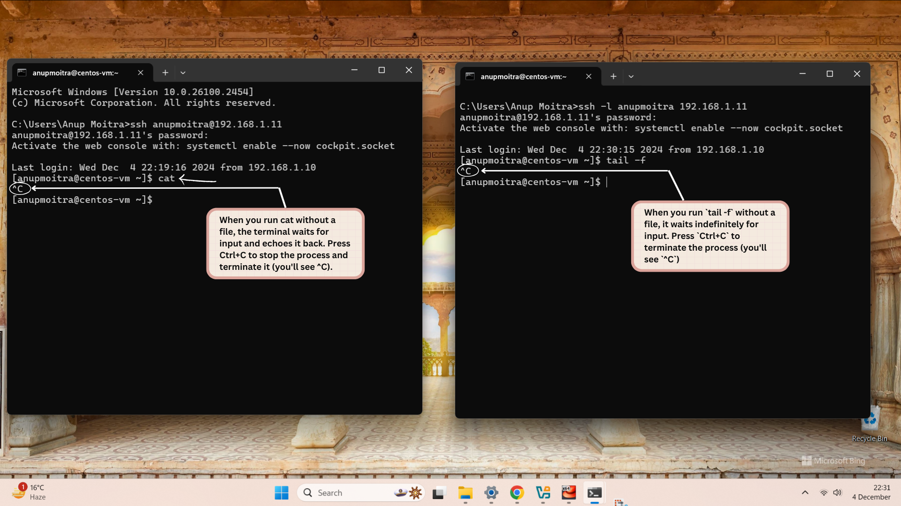

# **Module 2: System Access and File Management**  
## **Chapter 4: Command Line Basics - Regaining the Command Prompt Using Control + C**  
  

---

### **🖥️ Introduction**  
In this chapter, we will explore how to regain control of an unresponsive command prompt using the **Control + C** shortcut. This is a vital troubleshooting technique for managing long-running or stuck commands in the terminal.  

---

### **📚 What We Will Learn**  
- How to interrupt unresponsive commands using **Control + C**.  
- Verifying that the command prompt is responsive again.  
- Executing new commands after regaining control.  

---

### **1️⃣ Understanding Unresponsive Commands**  

Commands may sometimes cause the terminal to hang or become unresponsive. In such cases, **Control + C** can interrupt the command and return control to the user.  

**Example Scenarios**:  
- **`cat`** without specifying a file or redirecting input causes the terminal to "wait" for input, echoing back what is typed.  
- Long-running commands like **`find /`** that traverse the entire file system.  
- Monitoring large log files using **`tail -f`**, which generates continuous output.  

*Note: The commands mentioned will be explained in more detail in later chapters.*  

---

### **2️⃣ Steps to Regain Control Using Control + C**  

Follow these steps to interrupt an unresponsive command:  

1. **Press Control + C**:  
   - Sends an interrupt signal (`SIGINT`) to terminate the running process.  
   - You may see a `^C` message in the terminal, indicating that the process was interrupted.  

2. **Verify the Prompt Status**:  
   - Ensure the command prompt (e.g., `$` for a user or `#` for root) is visible. This confirms the terminal is responsive again.  

3. **Run a New Command**:  
   - If the terminal is active, try executing another command to confirm control has been restored.  

---

### **📸 Screenshot Example**  

Below is an example showing how **Control + C** interrupts an unresponsive command:  

  
*Figure 1: Example of using Control + C to regain control of the terminal.*  

---

### **3️⃣ Why Control + C Works**  

**Control + C** sends a `SIGINT` signal to the active process, instructing it to terminate immediately. This signal is specifically designed to allow users to regain control of the terminal efficiently.  

**Key Points to Remember**:  
- **Control + C** stops only the active process; it does not close the terminal.  
- If **Control + C** fails, advanced techniques like the `kill` command may be necessary (covered in future chapters).  

---

### **✅ Conclusion**  

Using **Control + C** is a quick and essential technique for regaining control of an unresponsive terminal. By interrupting commands and returning to the prompt, you can efficiently troubleshoot and manage your terminal workflow. Mastering this fundamental skill is a critical step in becoming proficient with the Linux command line.  

---
