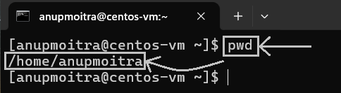
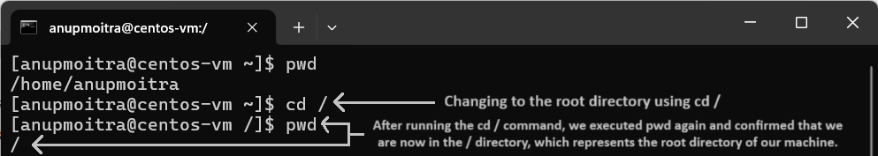
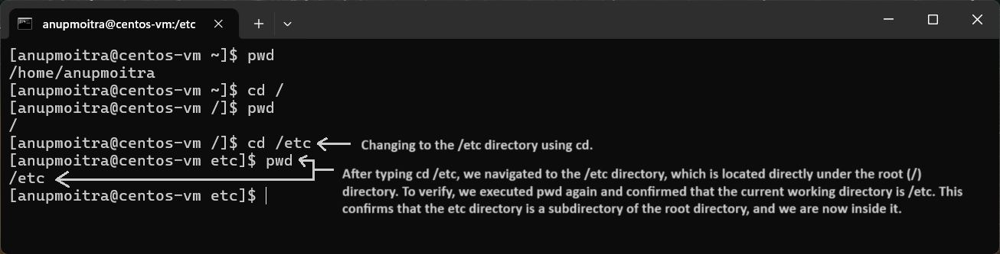
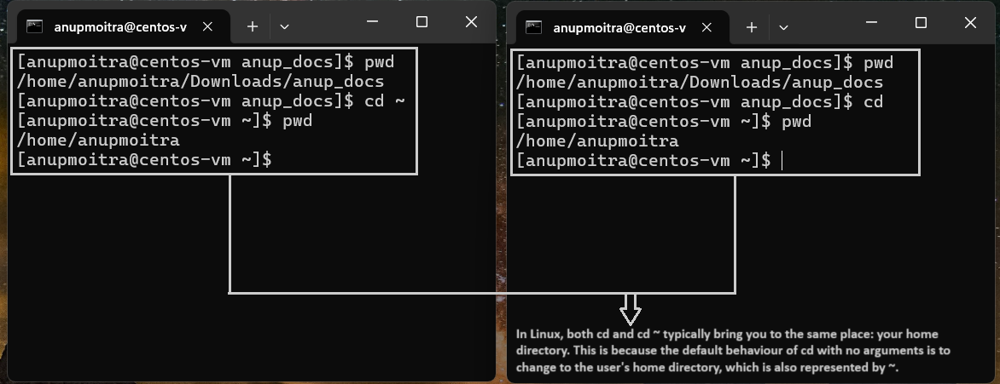

# **Module 2: System Access and File Management**  
## **Chapter 6: Navigating the File System (`cd`, `ls`, `pwd`)**  
    

---

### **🖥️ Introduction**  
In this chapter, we will explore the fundamental Linux commands for navigating the file system:  
- **`pwd`**: Print the full path of the current working directory.  
- **`cd`**: Change the current directory.  
- **`ls`**: List the contents of a directory.  

Mastering these commands is essential for navigating and managing files in a Linux environment effectively.  

---

### **1️⃣ `pwd`: Print Working Directory**  
The `pwd` command displays the full path of your current location in the file system. It confirms your current working directory.  

**Example Command**:  
```bash
pwd
```  

**Example Output**:  
```
/home/anupmoitra
```  

**Screenshot Example**:  
  
*Figure 1: Displaying the current directory using `pwd`.*  

---

### **2️⃣ `cd`: Change Directory**  
The `cd` command is used to navigate between directories in the Linux file system.  

#### **Common Usage Examples**:  

1. **Navigate to the Root Directory**:  
   ```bash
   cd /
   ```  
   **Screenshot Example**:  
     
   *Figure 2: Changing to the root directory using `cd /`.*  

2. **Navigate to a Specific Directory**:  
   ```bash
   cd /etc
   ```  
   **Screenshot Example**:  
     
   *Figure 3: Changing to the `/etc` directory using `cd`.*  

3. **Go Back One Directory Level**:  
   ```bash
   cd ..
   ```  
   **Screenshot Example**:  
     
   *Figure 4: Moving back one directory level with `cd ..`.*  

4. **Return to the Home Directory**:  
   ```bash
   cd          # Takes you to your home directory  
   cd ~        # Also takes you to your home directory  
   ```  
   **Screenshot Example**:  
     
   *Figure 5: Returning to the home directory using `cd` or `cd ~`.*  

---

### **3️⃣ `ls`: List Directory Contents**  
The `ls` command lists the contents of a directory. It supports various options for detailed output.  

#### **Common Options**:  
- **`ls`**: Lists files and directories in the current directory.  
- **`ls -l`**: Displays detailed information (permissions, ownership, size) in a long listing format.  
- **`ls -lt`**: Displays detailed information sorted by modification time (newest first).  
- **`ls -ltr`**: Displays detailed information sorted by modification time (oldest first).  

#### **Example Commands and Screenshots**:  

1. **Basic `ls` Command**:  
   ```bash
   ls
   ```  
   **Screenshot Example**:  
     
   *Figure 6: Listing directory contents using `ls`.*  

2. **Detailed Listing with `ls -l`**:  
   ```bash
   ls -l
   ```  
   **Screenshot Example**:  
     
   *Figure 7: Detailed listing of directory contents using `ls -l`.*  

3. **Sorted by Modification Time with `ls -lt`**:  
   ```bash
   ls -lt
   ```  
   **Screenshot Example**:  
     
   *Figure 8: Directory contents sorted by modification time (newest first) using `ls -lt`.*  

4. **Sorted by Modification Time (Reverse Order) with `ls -ltr`**:  
   ```bash
   ls -ltr
   ```  
   **Screenshot Example**:  
     
   *Figure 9: Directory contents sorted by modification time (oldest first) using `ls -ltr`.*  

---

### **✅ Conclusion**  
By mastering the commands `pwd`, `cd`, and `ls`, you gain essential skills for exploring and managing the Linux file system. These commands form the foundation of Linux system administration and efficient file management.  

---
