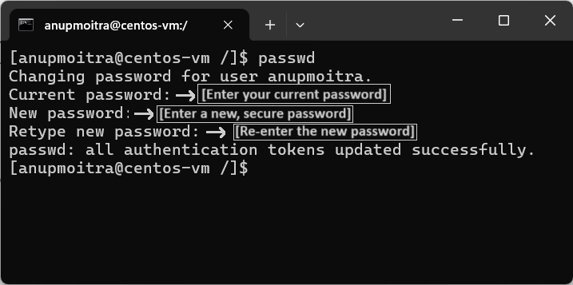
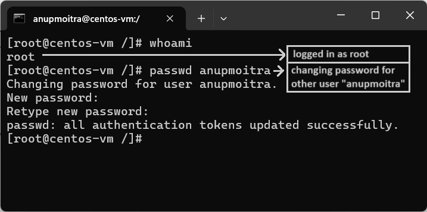

# **Module 2: System Access and File Management**  
## **Chapter 10: Changing User Passwords in Linux**  
   

---

### **📖 Introduction**  
Managing user passwords is a critical aspect of Linux system administration. The ability to change passwords ensures secure access and helps maintain system integrity.  

In this chapter, we will learn:  
- How to change your own password.  
- How to change another user's password (as root).  
- Password security best practices.  

---

### **🔑 1. The `passwd` Command**  
The `passwd` command is the primary tool for changing user passwords in Linux. It is simple and interactive, requiring minimal input.  

**Basic Syntax**:  
```bash
passwd [username]
```  

**Key Points**:  
- Without specifying a username, `passwd` changes the password of the currently logged-in user.  
- Only the root user can change another user’s password.  

---

### **🔒 2. Changing Your Own Password**  

#### **Steps**:  
1. **Open Terminal**: Log in and launch the terminal.  
2. **Run the `passwd` Command**:  
   ```bash
   passwd
   ```  
3. **Enter Current Password**: For verification, the system prompts you to enter your current password.  
4. **Set a New Password**: Enter a strong password that meets complexity requirements.  
5. **Confirm the Password**: Re-enter your new password for confirmation.  
6. **Success Message**: You’ll see:  
   `password authentication tokens updated successfully`.  

#### **Example**:  
```bash
$ passwd  
Changing password for user johndoe  
Current password: [Enter current password]  
New password: [Enter a secure password]  
Retype new password: [Re-enter the secure password]  
```  

#### **Security Tip**:  
Choose a password that includes:  
- At least 8 characters.  
- A mix of uppercase, lowercase, numbers, and symbols.  
- No dictionary words or easily guessable sequences like `12345`.  

#### **Screenshot**:  
  
*Figure 1: Changing Password for Current User*  

---

### **🛠️ 3. Changing Another User’s Password (As Root)**  

#### **Steps**:  
1. **Switch to Root User**: Use `sudo` or log in as the root account.  
2. **Run the `passwd` Command with the Username**:  
   ```bash
   sudo passwd <username>
   ```  
3. **Set a New Password**: Enter and confirm the new password for the user.  

#### **Example**:  
```bash
$ sudo passwd johndoe  
Changing password for user johndoe  
New password: [Enter a secure password]  
Retype new password: [Re-enter the secure password]  
```  

#### **Screenshot**:  
  
*Figure 2: Changing Another User’s Password as Root*  

---

### **⚠️ 4. Common Issues and Considerations**  

1. **Password Complexity Requirements**:  
   - Ensure your password includes a mix of characters and is sufficiently complex.  

2. **Minimum Length**:  
   - Default requirement is 8 characters, but system policies might vary.  

3. **Password History Policies**:  
   - Some systems prevent reusing recent passwords.  

#### **Common Errors**:  
- **"Password too short"**: Choose a longer password.  
- **"Password fails the dictionary check"**: Use a password that is not a common word.  

#### **Example Error Messages**:  
```bash
passwd: password too short  
passwd: password fails the dictionary check  
```  

---

### **📝 Conclusion**  
Changing passwords is a fundamental skill in Linux system management. By mastering the `passwd` command, you can ensure secure access for yourself and other users while adhering to best practices for password security.  

---
