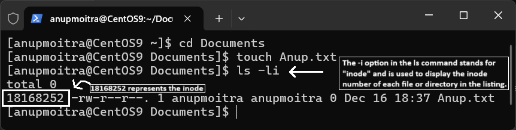
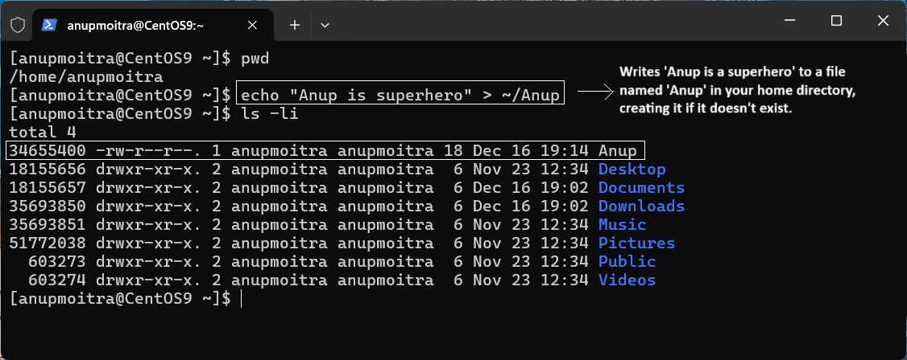
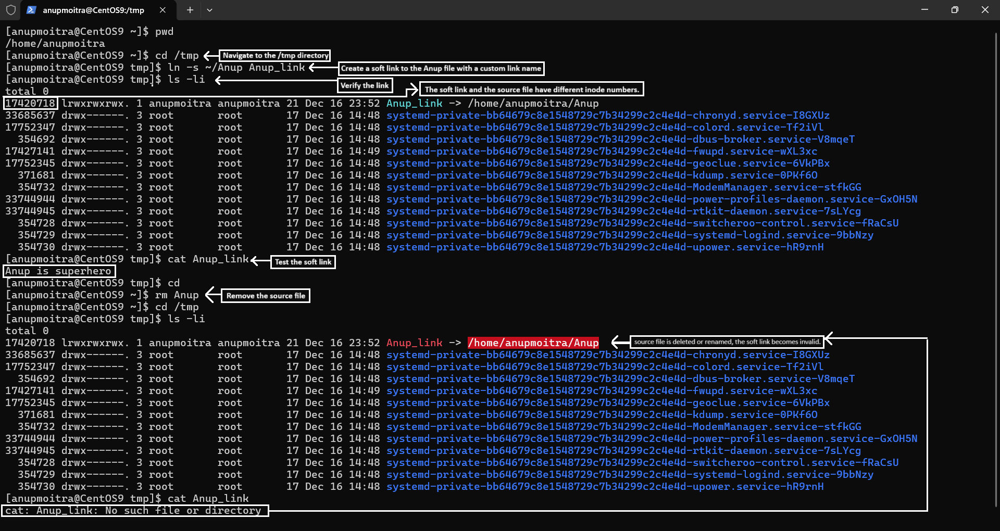

# **Module 2: System Access and File Management**

## **Chapter 16: Understanding Soft Links and Hard Links**

 

---

### **🔑 Introduction**  
In this chapter, we explore **soft links** and **hard links**, essential tools for Linux file management. First, let's delve into **inodes**, a fundamental component of Linux filesystems that underpins both concepts.

---

## **📚 Understanding Inodes**  

An **inode** is a unique identifier assigned to a file or directory in a Linux filesystem.  

- **For Humans**: We recognize files by their names (e.g., `Anup.txt`).  
- **For Computers**: Files are identified using inode numbers, which point to the file's data on disk.

Each inode contains metadata about the file, such as:  
- File size  
- Permissions  
- Ownership (user/group)  
- Timestamps (creation, last access, modification)

#### **Example**:  
Run `ls -li` to view inode information:  
```bash
ls -li
```
Output:  
```
18168252 -rw-r--r-- 1 user user 1024 Dec 16 12:00 Anup.txt
```  

Here, `18168252` is the inode number, linking `Anup.txt` to its data on the disk.  

  
*Figure 1: Inode number and metadata displayed using `ls -li`.*  

---

## **🔗 Soft Links**  

A **soft link** (symbolic link) acts as a shortcut to a file or directory.  

### **Key Features**  
- **Dependency on Source File**:  
  If the source file is deleted or renamed, the soft link breaks.  
- **Separate Inode**:  
  The soft link has a different inode than the source file.  
- **Best Use**:  
  Ideal for creating shortcuts to frequently accessed files.

### **How to Create a Soft Link**  

Use the `ln -s` command:  
```bash
ln -s <source_file> <link_name>
```

#### **Example**  
1. **Create a File**:  
   ```bash
   echo "Anup is a superhero" > ~/Anup
   ```
     
   *Figure 2: File `Anup` created in the home directory.*  

2. **Navigate to `/tmp`**:  
   ```bash
   cd /tmp
   ```

3. **Create a Soft Link**:  
   ```bash
   ln -s ~/Anup Anup_link
   ```

4. **Verify the Link**:  
   ```bash
   ls -li
   ```
   Output:  
   ```bash
   lrwxrwxrwx 1 user user 17 Dec 16 12:10 Anup_link -> /home/user/Anup
   ```

5. **Test the Link**:  
   ```bash
   cat Anup_link
   ```
   Output:  
   ```bash
   Anup is a superhero
   ```

6. **Delete the Source File**:  
   ```bash
   rm ~/Anup
   ```

   Accessing the soft link now results in an error:  
   ```bash
   cat: Anup_link: No such file or directory
   ```

     
   *Figure 3: Soft link creation, verification, and testing.*

---

## **🖇️ Hard Links**  

A **hard link** is another reference to the same file data on disk.  

### **Key Features**  
- **Independent of Source File**:  
  The hard link remains valid even if the source file is renamed or deleted.  
- **Same Inode**:  
  Both the source file and hard link share the same inode.  
- **Best Use**:  
  Ideal for creating backups or accessing files from multiple locations.

### **How to Create a Hard Link**  

Use the `ln` command:  
```bash
ln <source_file> <link_name>
```

#### **Example**  
1. **Recreate the File**:  
   ```bash
   echo "Anup is a superhero" > ~/Anup
   ```

2. **Navigate to `/tmp`**:  
   ```bash
   cd /tmp
   ```

3. **Create a Hard Link**:  
   ```bash
   ln ~/Anup Anup_hardlink
   ```

4. **Verify the Hard Link**:  
   ```bash
   ls -li
   ```
   Notice that `Anup` and `Anup_hardlink` share the same inode number.

5. **Modify the Source File**:  
   ```bash
   echo "123" >> ~/Anup
   ```

6. **Check the Hard Link**:  
   ```bash
   cat Anup_hardlink
   ```
   Output:  
   ```bash
   Anup is a superhero  
   123
   ```

7. **Delete the Source File**:  
   ```bash
   rm ~/Anup
   ```

   The hard link remains accessible:  
   ```bash
   cat Anup_hardlink
   ```
   Output:  
   ```bash
   Anup is a superhero  
   123
   ```

     
   *Figure 4: Hard link creation, verification, and testing.*

---

## **⚖️ Comparison: Soft Links vs. Hard Links**  

| **Feature**             | **Soft Link**                                | **Hard Link**                                |
|-------------------------|----------------------------------------------|----------------------------------------------|
| **Inode Number**        | Different from the source file               | Same as the source file                      |
| **Dependency on Source**| Breaks if source is deleted or renamed       | Remains valid if source is deleted           |
| **Cross-File Systems**  | Can link across different filesystems        | Cannot link across different filesystems     |
| **File Size Impact**    | Minimal (stores the file path)               | Shares the same size as the source file      |

---

## **✅ Summary**  

1. **Soft Links**:  
   - Function like shortcuts.  
   - Depend on the source file.  
2. **Hard Links**:  
   - Provide an additional direct reference to the file data.  
   - Independent of the source file.  

Understanding and using these links efficiently can streamline your file management tasks in Linux.  

---
